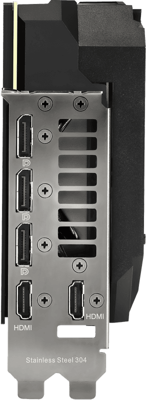

Some cards I can't find the exact mm height of, they specify "slot size" like "2.2 slots". Usually this can be calculated by doing slots * 21, but it might be incorrect.

| | Brand | Model | Power pins | Length (mm) | Width (mm) | Height (mm) |
| - | - | - | - | - | - | - |
|  | Nvidia | Founders Edition | 1x 12 (2x 8 adapter) | 285 | 112 | 42 |
|  | EVGA | XC3 | 2x 8 | 285.37 | 111.15 | 2.2 slots (46.2) |
|  | EVGA | Hydro Copper | 2x 8 | ? | ? | <= 2 slots? |
|  | EVGA | Hybrid | 2x 8 | ? | ? | <= 2 slots? |
|  | Asus | TUF Gaming | 2x 8 | 299.9 | 126.9 | 51.6 |
|  | EVGA | FTW3 | 2x 8 | 300 | 136.75 | 55.55 |
|  | MSI | Gaming (X) Trio | 3x 8 | 323 | 140 | 56 |
|  | Asus | ROG Strix | 3x 8 | 318.5 | 140.1 | 57.8 |
|  | MSI | Ventus 3X | 2x 8 | 305 | 120 | 57 |
|  | Gigabyte | Master/  Extreme | 3x 8 | ? | ? | >= 3 slots? |
|  | Inno3D | Twin X2 | 2x 8 | ? | ? | ? |
|  | Inno3D | iChill X3 | 2x 8 | ? | ? | ? |
|  | Inno3D | iChill X4 | 2x 8 | ? | ? | ? |